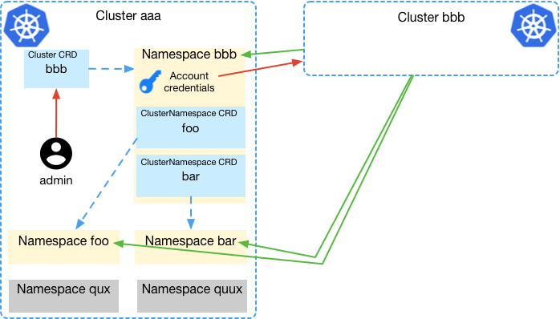

# Cloned from https://gitlab.com/ucsd-prp/nrp-controller 

# NRP controller

This project provides code for NRP controller - the component allowing to federate kubernetes clusters according to internal cluster policies.

The problem solved by this controller is giving kubernetes cluster admins ability to easily delegate permissions to other clusters admins to deploy in this cluster and access its resources. The set of resources and policies is defined by a cluster role and can vary for different clusters.

**Example:** cluster_A federates with cluster_B:

* Admin in cluster_A creates cluster_B's CRD object, which triggers autiomatic creation of all needed permissions and credentials.
* Credentials are then sent to cluster_B admins who use the credentials to access cluster_A resources. 
* All the resources and permissions are removed via deletion of the cluster_B object when no longer needed. 
* Permissions modification is trivial and is well described in kubernetes documentation [Using RBAC Authorization](https://kubernetes.io/docs/reference/access-authn-authz/rbac/) and [Pod Security Policies](https://kubernetes.io/docs/concepts/policy/pod-security-policy/).



### Development

```bash
# download repository
$ go get gitlab.com/ucsd-prp/nrp-controller

# From project folder:
$ cd nrp-controller
$ dep ensure
$ ./codegen.sh
$ make buildrelease
```

### Installation

1. Start the federation role: 
   
   Edit the federation-role.yaml file in this repo and apply:
   ```bash
   $ kubectl apply -f ./federation-role.yaml
   ```

   Or apply it from web if standard admin role is fine:

   ```bash
   $ kubectl apply -f    $ kubectl apply -f https://gitlab.com/ucsd-prp/nrp-controller/raw/master/federation-role.yaml

   ```

2. Start the controller:

   ```bash
   $ kubectl apply -f https://raw.githubusercontent.com/slateci/nrp-clone/main/deploy.yaml
   ```

### Using

The controller defines 2 types of [CRDs](https://kubernetes.io/docs/concepts/extend-kubernetes/api-extension/custom-resources/): 

* clusters.nrp-nautilus.io - a CRD for each external federated cluster (or some other entity that needs to federate)

* clusternamespaces.nrp-nautilus.io - additional namespaces in the current cluster that belong to the external federated cluster

```bash
$ kubectl get crds | grep nrp-nautilus
clusternamespaces.nrp-nautilus.io             2018-09-06T01:42:40Z
clusters.nrp-nautilus.io                      2018-09-06T00:50:33Z
```

The **clusters.nrp-nautilus.io** are cluster-wide.

To federate with another cluster, we create the Cluster CRD object. The controller is watching the cluster objects, and will create the namespace corresponding to the cluster name. If such namespace is already taken, the controller will prepend a number to it. The cluster object will have the spec/namespace field changed to have the name of primary namespace. Inside the namespace it will create a service account with role binding to cluster-federation ClusterRole. Once the cluster is deleted, the associated namespace and all its contents will be also deleted.

[](https://asciinema.org/a/BWXytQziditkuW0jAR4reGonx)

For new service account kubernetes automatically creates a token which will allow the federated cluster to act as this service account in the current cluster. By default, the account only has an access to its primary namespace. The token can be then added to a config file and securely sent to the admins of the federated cluster, providing them with an access to this cluster according to the admin-defined cluster-federation role.

[](https://asciinema.org/a/ZYIPVyFwqC3SkhnNNMBUmJsdI)

To request a creation of additional namespaces in the same federated cluster, one needs to create a "clusternamespace" CRD object in its namespace. The operator will discover the new object and create the corresponding namespace with same service account in it, so that the same token will be valid to access both primary namespace and any additional ones. Deleting the clusternamespace object will result in deletion of the corresponding namespace. Deletion of the cluster object by admin will result in deletion of the primary and all additional namespaces.

[](https://asciinema.org/a/l7pwo4kXPV4XcWYoGfNlAUEat)


